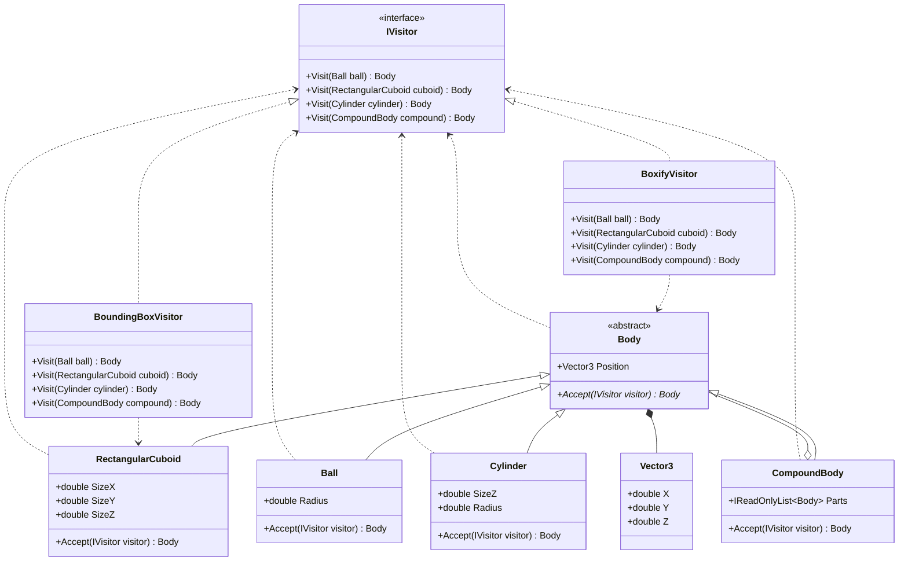

# Практика: Геометрия-2

## 1. Описание предметной области и сущностей

Программа реализует паттерн Visitor для выполнения различных операций над трехмерными геометрическими телами. Базовый абстрактный класс Body представляет геометрическую фигуру с позицией в пространстве и содержит метод Accept для приема посетителя. Конкретные фигуры - Ball (шар с радиусом), RectangularCuboid (прямоугольный параллелепипед с размерами по осям), Cylinder (цилиндр с радиусом и высотой) и CompoundBody (составное тело, содержащее список частей) - переопределяют Accept, вызывая соответствующий метод посетителя. Интерфейс IVisitor определяет методы Visit для каждого типа фигуры, а два его реализации выполняют разные операции: BoundingBoxVisitor вычисляет минимальный ограничивающий параллелепипед для любой фигуры, а BoxifyVisitor заменяет все простые тела на их ограничивающие параллелепипеды, сохраняя структуру составных тел.

## 2. Диаграмма классов

