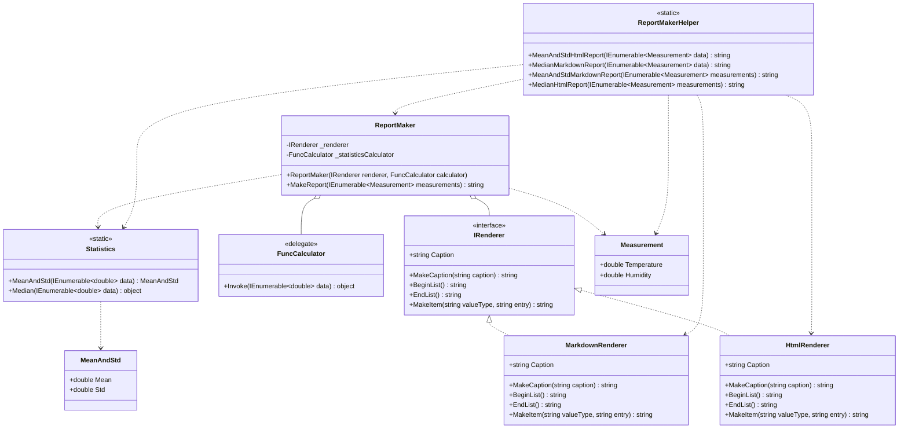

# Практика: Генератор отчетов

## 1. Описание предметной области и сущностей

Программа генерирует статистические отчеты по данным погодных измерений (температура и влажность), вычисляя различные показатели и выводя их в разных форматах. Система разделена на две независимые стратегии: форматирование отчета (IRenderer) и вычисление статистики (делегат FuncCalculator). HtmlRenderer и MarkdownRenderer отвечают за визуальное оформление в HTML и Markdown соответственно, а методы Statistics.MeanAndStd и Statistics.Median выполняют математические расчеты. ReportMaker объединяет обе стратегии через конструктор и формирует итоговый отчет, а ReportMakerHelper предоставляет удобные методы для создания четырех комбинаций отчетов (HTML/MeanAndStd, HTML/Median, Markdown/MeanAndStd, Markdown/Median).

## 2. Диаграмма классов

