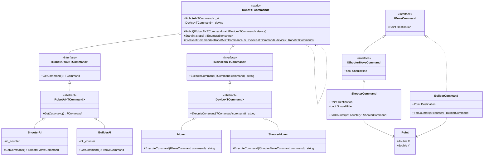

# Практика: Роботы

## 1. Описание предметной области и сущностей

Программа моделирует систему управления роботами, состоящую из интеллектуальной системы (AI), генерирующей команды, и исполнительного устройства (Device), выполняющего эти команды. Основная задача - обеспечить строгую типизацию с использованием ковариантности (out T) для интерфейса IRobotAI и контравариантности (in T) для интерфейса IDevice, что позволяет гибко комбинировать AI, возвращающие более конкретные команды, с устройствами, принимающими более общие команды. В системе реализованы два типа роботов: ShooterAI с командой IShooterMoveCommand и BuilderAI с командой IMoveCommand, а также устройства Mover и ShooterMover для выполнения соответствующих команд.

## 2. Диаграмма классов

