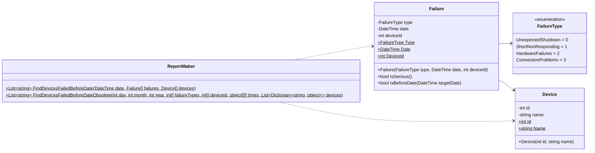

# Практика: Сбои

## 1. Описание предметной области и сущностей

Программа предназначена для анализа сбоев оборудования и формирования отчета об устройствах, на которых до заданной даты происходили критические неисправности. В системе выделены следующие сущности: Device (устройство с идентификатором и названием), Failure (запись о сбое с типом, датой и ссылкой на устройство) и FailureType (перечисление типов неисправностей). Основной класс ReportMaker содержит метод FindDevicesFailedBeforeDate, который фильтрует серьезные сбои (UnexpectedShutdown и HardwareFailures) по дате и возвращает список названий проблемных устройств. Устаревший метод FindDevicesFailedBeforeDateObsolete сохранен для обратной совместимости и преобразует старые форматы данных для вызова нового метода.

## 2. Диаграмма классов

